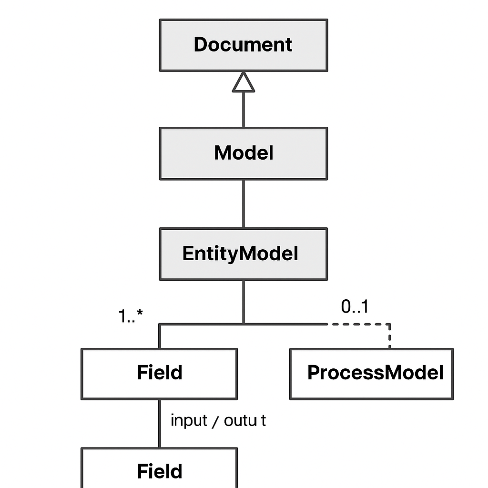

# ForgeSpec v1.0.0 — Especificación Técnica

**ForgeSpec** es una especificación formal, extensible y agnóstica a la plataforma, orientada a la definición estructurada de entidades y procesos de negocio. Su propósito central es establecer una gramática común que permita describir de forma precisa y reutilizable los elementos conceptuales del dominio, habilitando así la generación automatizada de artefactos técnicos.

ForgeSpec promueve la separación entre el modelo de información y sus mecanismos de implementación, facilitando la interoperabilidad, la consistencia semántica y la automatización en arquitecturas basadas en contratos.

---

## Tabla de Contenidos

1. [Objeto y Alcance](#objeto-y-alcance)
2. [Principios Rectores](#principios-rectores)
3. [Esquema General del Documento](#esquema-general-del-documento)
4. [Tipos de Modelo](#tipos-de-modelo)
   - [`entity`](#modelo-de-tipo-entity)
   - [`process`](#modelo-de-tipo-process)
5. [Definición del Tipo `Field`](#definición-del-tipo-field)
6. [Reglas de Conformidad](#reglas-de-conformidad)
7. [Gestión de Versiones](#gestión-de-versiones)
8. [Implementación](#implementación)
9. [Representación del Metamodelo](#representación-del-metamodelo)
10. [Extensiones y Evolución Esperada](#extensiones-y-evolución-esperada)

---

## Objeto y Alcance

La especificación ForgeSpec define un lenguaje de modelado declarativo cuyo dominio de aplicación abarca tanto estructuras de datos persistentes (entidades) como procesos operativos (servicios, flujos, comandos). Su diseño permite representar el conocimiento de negocio de manera estandarizada, legible por humanos y procesable por máquinas.

No constituye un lenguaje de programación ni una especificación de transporte, y no define comportamientos en tiempo de ejecución. ForgeSpec es una capa conceptual sobre la cual pueden construirse generadores, validadores, orquestadores y sistemas de documentación técnica.

---

## Principios Rectores

- **Neutralidad tecnológica**: Los modelos definidos con ForgeSpec no dependen de un lenguaje, framework o protocolo específico.
- **Claridad semántica**: El conjunto de términos utilizados está cuidadosamente controlado para minimizar ambigüedades.
- **Separación de responsabilidades**: La definición estructural se disocia explícitamente de su uso o despliegue.
- **Extensibilidad progresiva**: La especificación admite mecanismos formales de expansión.
- **Consistencia y auditabilidad**: El formato estructurado permite validar, versionar y rastrear los cambios de forma sistemática.

---

## Esquema General del Documento

Todo documento ForgeSpec debe incluir los siguientes elementos en su nivel raíz:

| Clave        | Tipo     | Obligatorio | Descripción                                                             |
|--------------|----------|-------------|-------------------------------------------------------------------------|
| `forgespec`  | string   | Sí          | Versión exacta de la especificación utilizada. Ej.: "1.0.0".         |
| `type`       | string   | Sí          | Clasificación del modelo: `entity` o `process`.                         |

---

## Tipos de Modelo

### Modelo de tipo `entity`

Representa una estructura semántica de datos del dominio, la cual se compone de atributos con nombre, tipo y propiedades adicionales. Las entidades suelen corresponder a recursos persistentes, y pueden ser mapeadas a capas de almacenamiento o serialización.

**Elementos obligatorios**:
- `entity`: Identificador único del modelo en contexto.
- `fields`: Lista ordenada de componentes del tipo `Field`.

**Elementos opcionales**:
- `description`: Texto explicativo.
- `crud`: Objeto que define las operaciones permitidas sobre la entidad (`create`, `read`, `update`, `delete`), cada una expresada como un valor booleano.

---

### Modelo de tipo `process`

Define una operación lógica, funcional o computacional que toma uno o más datos de entrada y produce un resultado, sin implicar necesariamente persistencia. Está orientado a representar servicios, cálculos, flujos u otras acciones del negocio.

**Elementos obligatorios**:
- `process`: Identificador nominal de la operación.
- `input`: Lista de objetos del tipo `Field` que constituyen los parámetros de entrada.

**Elementos opcionales**:
- `output`: Lista de objetos del tipo `Field` que componen la estructura esperada de salida.
- `rest`: Objeto que define una interfaz HTTP opcional, compuesta por `method` y `path`.
- `description`: Texto descriptivo de propósito general.

---

## Definición del Tipo `Field`

Un objeto del tipo `Field` representa un componente atómico de información. Su uso es uniforme tanto para describir los atributos de una entidad como los parámetros de entrada o salida de un proceso.

| Clave        | Tipo     | Obligatorio | Descripción                                                                |
|--------------|----------|-------------|----------------------------------------------------------------------------|
| `name`       | string   | Sí          | Nombre técnico del campo.                                                  |
| `type`       | string   | Sí          | Tipo de dato base (`string`, `integer`, `boolean`, `number`, etc.).        |
| `format`     | string   | No          | Formato específico, útil para validación semántica (`uuid`, `email`, etc.).|
| `required`   | boolean  | No          | Indica si el campo es obligatorio en los contextos de entrada.             |
| `readOnly`   | boolean  | No          | Señala si el campo solo debe aparecer en respuestas.                       |
| `description`| string   | No          | Comentario en lenguaje natural, opcional y multilingüe.                    |

---

## Reglas de Conformidad

Un documento es conforme a la versión `1.0.0` de ForgeSpec si cumple con los siguientes criterios:

- Incluye las claves `forgespec` y `type` en la raíz.
- Si `type` es `entity`, debe contener `entity` y `fields`.
- Si `type` es `process`, debe contener `process` e `input`.
- Cada objeto del tipo `Field` debe contener, como mínimo, las claves `name` y `type`.
- No se admiten claves no documentadas salvo que sean parte de una extensión aprobada oficialmente.

---

## Gestión de Versiones

ForgeSpec adopta una política de versionamiento semántico en la forma `x.y.z`, donde:

- **x** (major): representa cambios incompatibles con versiones anteriores;
- **y** (minor): indica la introducción de nuevas capacidades que mantienen compatibilidad;
- **z** (patch): señala correcciones y ajustes menores sin impacto estructural.

Cada documento ForgeSpec debe declarar explícitamente la versión con la cual es conforme, lo cual garantiza trazabilidad y validación formal precisa.

---

## Implementación

Para facilitar la adopción práctica de la especificación ForgeSpec, se ha elaborado una [guía de implementación](./implementation.md) que presenta ejemplos formales de modelos del tipo `entity` y `process`, validados conforme a la versión 1.0.0.

Esta guía también incluye lineamientos para validación estructural, orientaciones sobre herramientas compatibles y consideraciones para la generación futura de contratos y artefactos derivados.

Se recomienda su lectura a todos los equipos técnicos interesados en integrar ForgeSpec en sus flujos de diseño, documentación o generación de interfaces.

---

## Representación del Metamodelo

La siguiente representación visual sintetiza la estructura conceptual de ForgeSpec en su versión 1.0.0. Este metamodelo establece las relaciones jerárquicas y composicionales entre los elementos que conforman un documento conforme a la especificación:

- `Document` representa la raíz del modelo.
- `Model` es una abstracción que puede adoptar la forma de `EntityModel` o `ProcessModel`.
- `EntityModel` compone uno o más elementos del tipo `Field`.
- `ProcessModel` incorpora `input` obligatorio, `output` opcional, y puede estar asociado a una especificación REST (`RestSpec`).

Para descarga directa del metamodelo en formato PNG:  
[Descargar metamodelo (PNG)](https://github.com/apifactory-org/forge-spec/raw/main/0e3c5c8a-7b1f-48c0-acd0-5a535b9ba616.png)

## Extensiones y Evolución Esperada

Las siguientes funcionalidades se consideran candidatas a futuras versiones mayores o módulos de extensión formalizados:

- Definición de relaciones entre modelos (`hasOne`, `hasMany`, `composition`).
- Inclusión y herencia de modelos mediante mecanismos como `extends` o `includes`.
- Soporte para estructuras reutilizables mediante `traits`.
- Anotaciones formales de seguridad, visibilidad y reglas de acceso.
- Declaraciones estructuradas para compatibilidad inversa y depreciación.
- Esquemas de generación para contratos OpenAPI, AsyncAPI y definiciones JSON Schema.

---

© 2025 ForgeSpec Initiative — Esta especificación se distribuye bajo licencia MIT.

